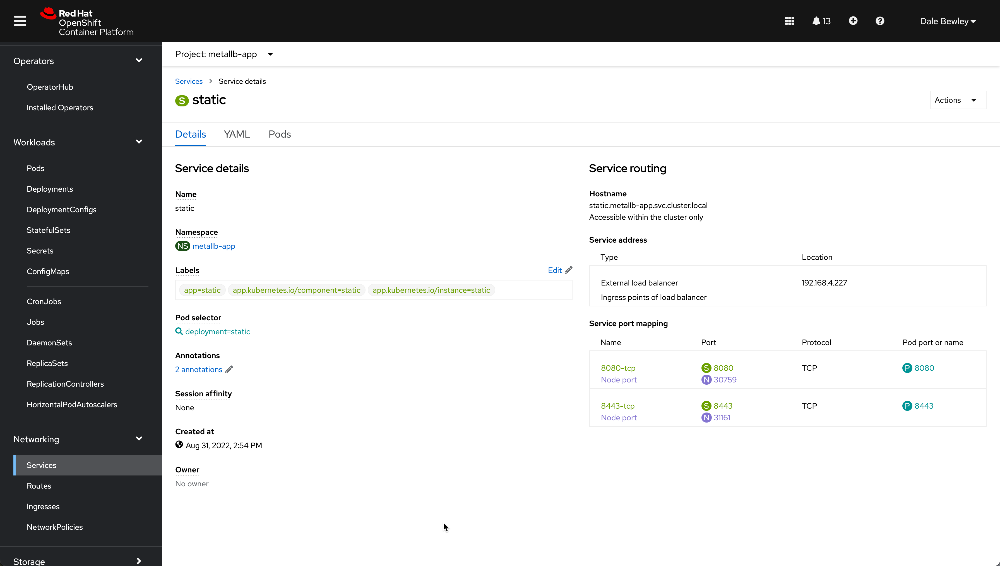

# Demo MetalLB

Simple example illustrating the use of MetalLB on OpenShift.

* Infrastructure provider vSphere
* MetalLB mode is layer2
* Node machines are on 192.168.4.0/24
* Address pool is defined as 192.168.4.224/29

# Deploy MetalLB

* Install operator and create address pool resource

```bash
oc apply -k metallb
```

# Use MetalLB

An example app was generated as follows plus [this patch](example-app/patch-service.yaml) to make it use MetalLB.

`oc new-app --name static nginx~https://github.com/dlbewley/static.git --dry-run -o yaml > application.yaml`

Deploy the app.

```bash
oc apply -k example-app
```

## Examine the results

Notice the service has an External-IP and that the containers are using NodePorts

```bash
oc get svc -n metallb-app
NAME     TYPE           CLUSTER-IP      EXTERNAL-IP     PORT(S)                         AGE
static   LoadBalancer   172.30.74.176   192.168.4.227   8080:30759/TCP,8443:31161/TCP   11m

$ oc get service/static -n metallb-app -o yaml | yq e '.spec.ports' -
- name: 8080-tcp
  nodePort: 30759
  port: 8080
  protocol: TCP
  targetPort: 8080
- name: 8443-tcp
  nodePort: 31161
  port: 8443
  protocol: TCP
  targetPort: 8443
```




```bash
$ oc get pods -n metallb-app -o wide
NAME                      READY   STATUS      RESTARTS   AGE   IP            NODE                     NOMINATED NODE   READINESS GATES
static-1-build            0/1     Completed   0          19m   10.128.4.67   hub-kmbtb-worker-t6czb   <none>           <none>
static-699d8bb6f4-shxjq   1/1     Running     0          18m   10.131.1.2    hub-kmbtb-worker-p9pws   <none>           <none>

$ oc get endpoints -n metallb-app
NAME     ENDPOINTS                         AGE
static   10.131.1.2:8080,10.131.1.2:8443   11m
```

Access the app using the external IP on the service. Feel free to create and DNS A resource records you like pointing to 192.168.4.227.

```bash
$ curl 192.168.4.227:8080/app/
<html>
<head>
<title>Static Web Site</title>
</head>
<body>
<h1>Static Content</h1>
<p></p>
</body>
</html>
```
